# Введение в R
Выполнено Кашинцевой Алиной Евгеньевной (l1ndo888@yandex.ru)

# Лабораторная работа №1

## Цель работы

1.  Развить практические навыки использования языка программирования R
    для обработки данных
2.  Развить навыки работы в Rstudio IDE:

-   установка пакетов
-   работа с проектами в Rstudio
-   настройка и работа с Git

1.  Закрепить знания базовых типов данных языка R и простейших операций
    с ними

## Шаги

1.  После установки swirl запускаем задание с помощью команды
    swirl::swirl() и выбираем 1 пункт

<!-- -->

    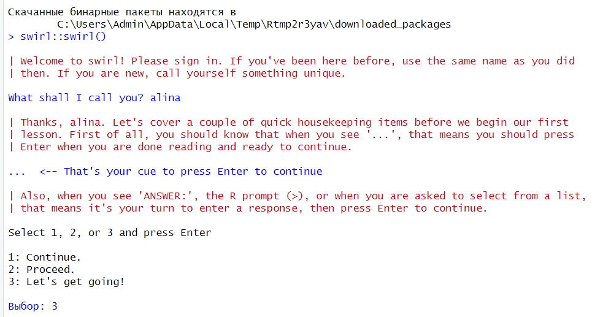

1.  Basic Building Blocks 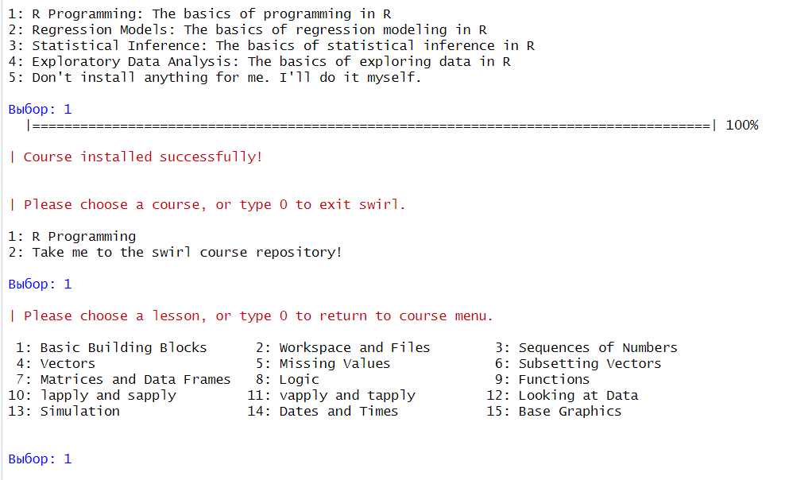

    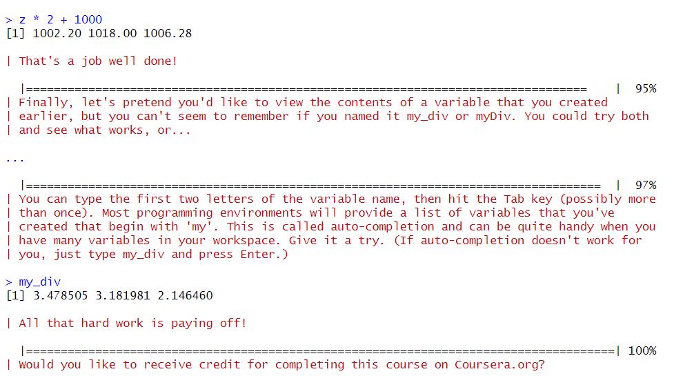

2.  Workspace and Files 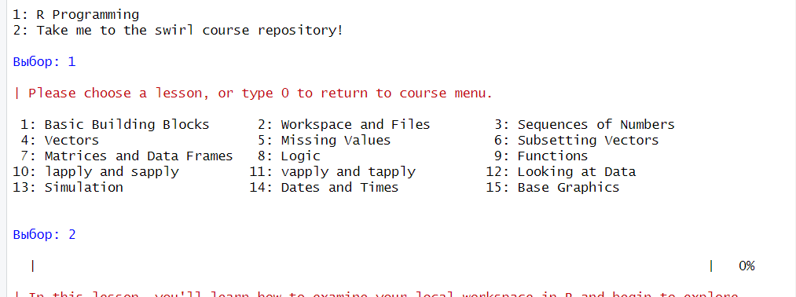 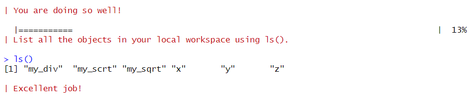 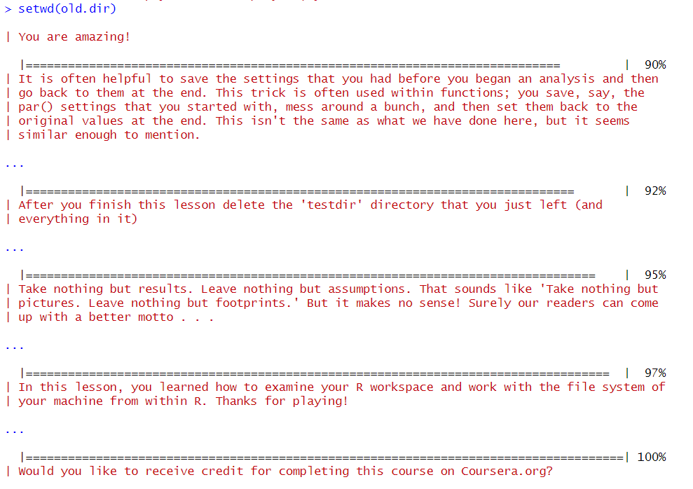

3.  Sequences of Numbers 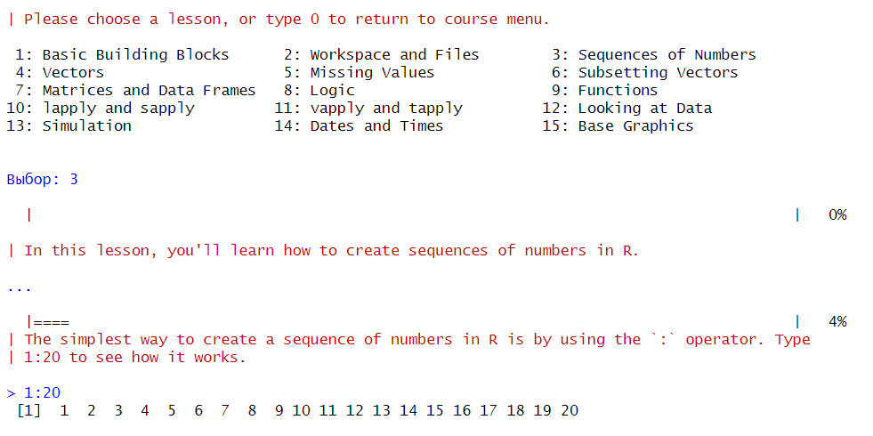 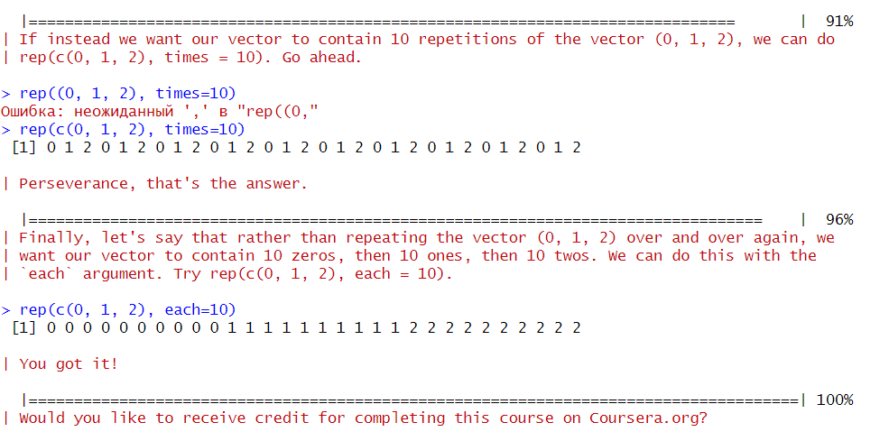

4.  Vectors 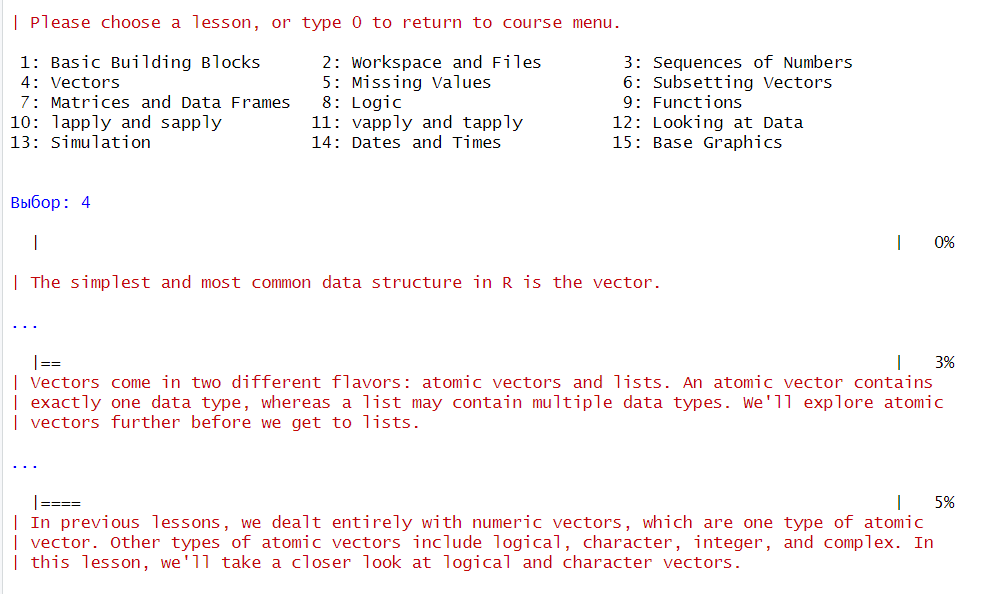 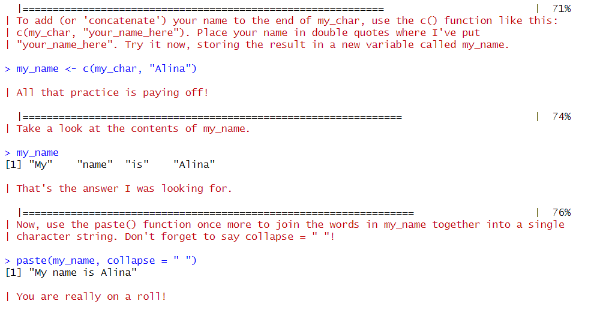 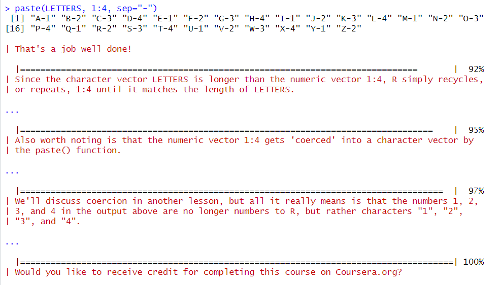

5.  Missing Values 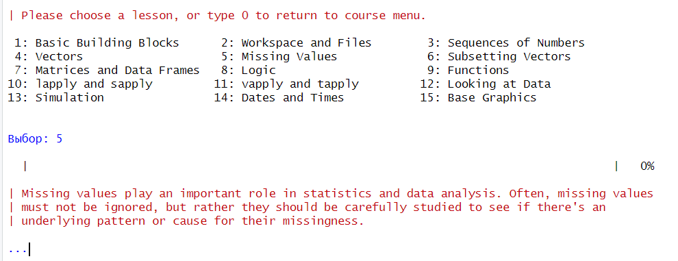 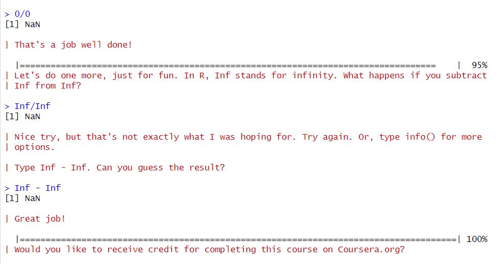

## Вывод

В результате работы была установлена библиотека swirl и пройдены все 5
модулей курса “R Programming: The basics of programming in R”

По окончании этого курса были развиты практические навыки использования
языка программирования R для обработки данных и закреплены знания
базовых типов данных языка R и простейших операций с ними
