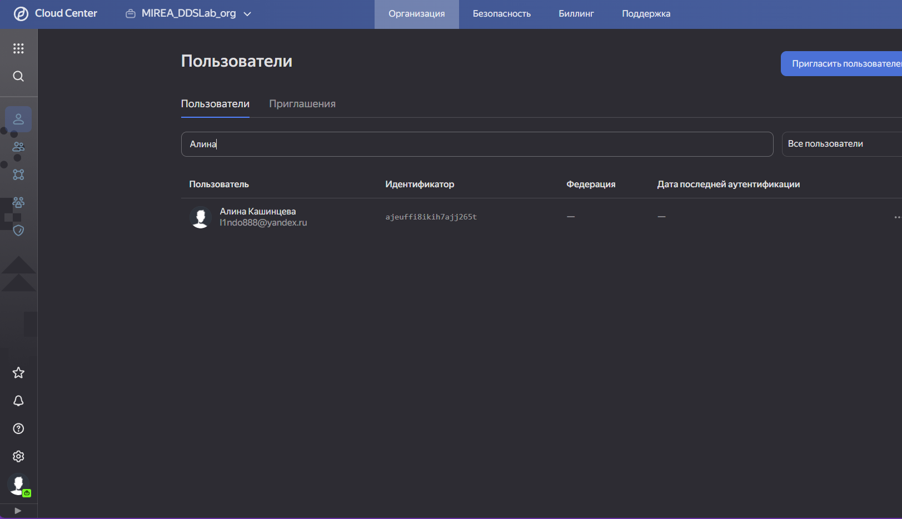
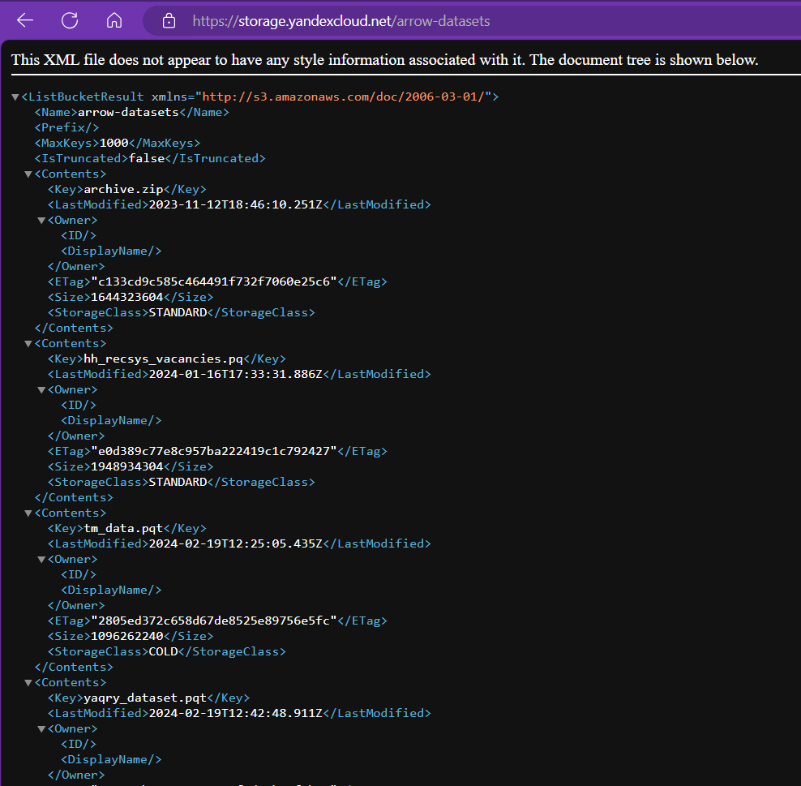
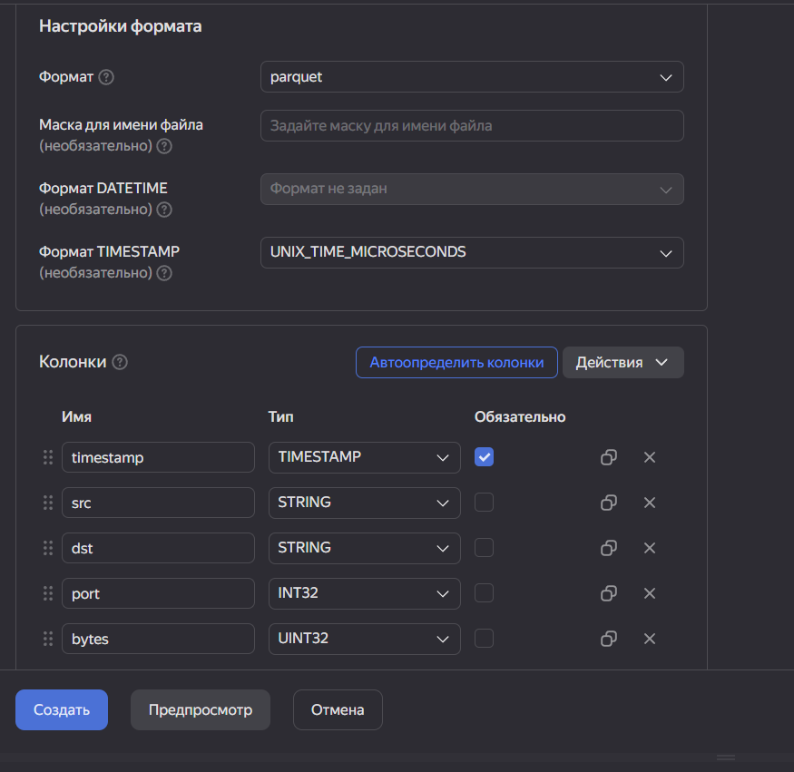
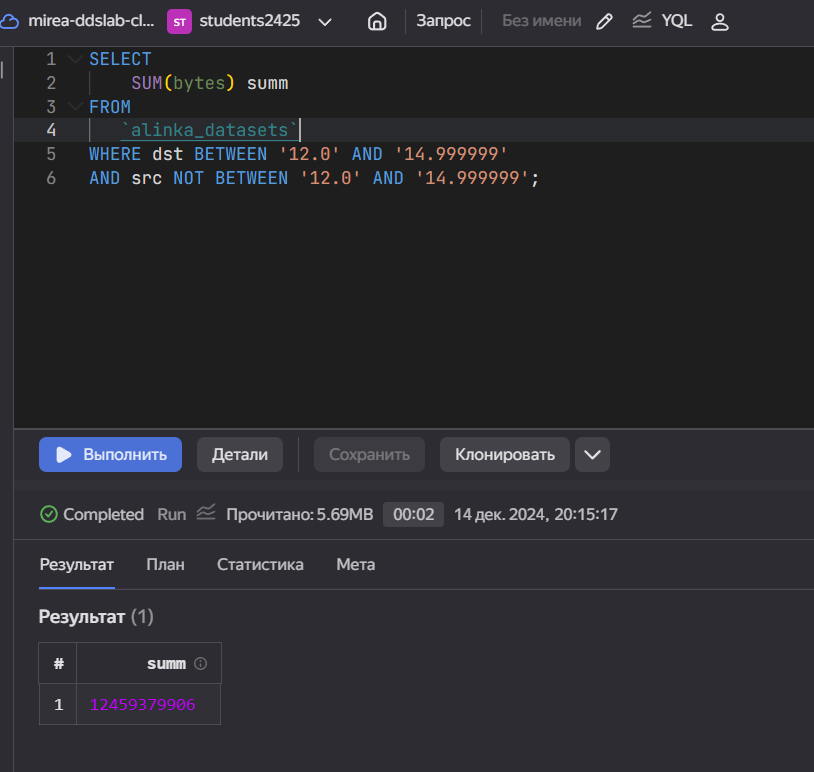

# Использование технологии Yandex Query для анализа данных сетевой
активности
Выполнено Кашинцевой Алиной Евгеньевной (l1ndo888@yandex.ru)

# Лабораторная работа №4

## Цель работы

1.  Изучить возможности технологии Yandex Query для анализа
    структурированных наборов данных
2.  Получить навыки построения аналитического пайплайна для анализа
    данных с помощью сервисов Yandex Cloud
3.  Закрепить практические навыки использования SQL для анализа данных
    сетевой активности в сегментированной корпоративной сети

## Ход выполнения работы

### Присоединение к организации

Проверка доступности данных (файл `yaqry_dataset.pqt`) в бакете
`arrow-datasets` S3 хранилища Yandex Object Storage. 

### Подключение бакета как источник данных для Yandex Query

Создание соединения (тип аутентификации - публичный) для бакета в S3
хранилище 

После создания соединения нужно настроить привязку 
Определим колонки в соответствие с структурой датасета 

### Анализ

#### 1. Известно, что IP адреса внутренней сети начинаются с октетов, принадлежащих интервалу \[12-14\]. Определите количество хостов внутренней сети, представленных в датасете.

#### 2. Определите суммарный объем исходящего трафика

#### 3. Определите суммарный объем входящего трафика

# Вывод

В результате выполнения работы было установлено соединение с датасетом и
выполнены задания. Также был проанализирован датасет
исходящего/входящего трафика с использованием sql-запросов.
